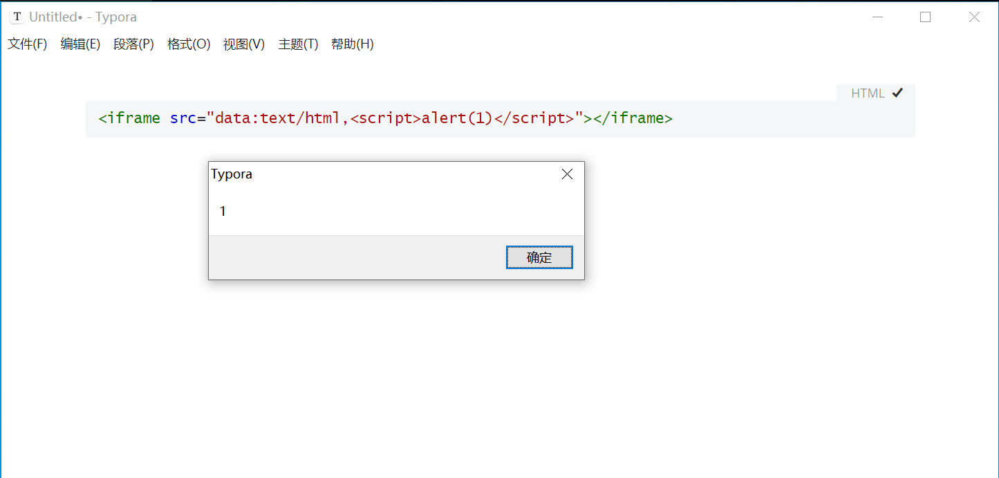
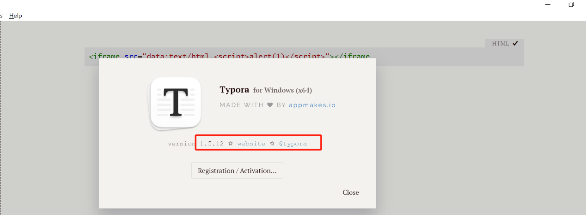
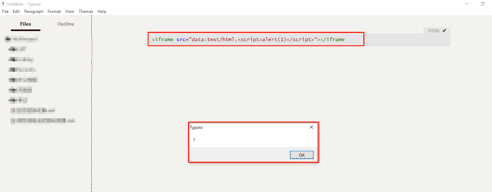
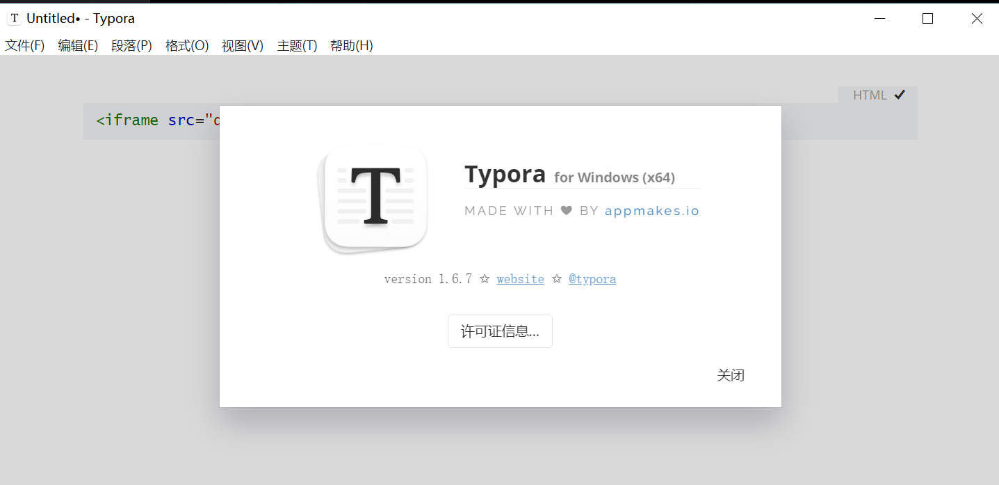

## TyporaXSS

### Typora vulnerability range

​	 0.9.93<Typora<=1.6.7

### Typora Description

​	Typora - a Markdown editor and Markdown reader. It allows you to write and read documents through seamless real-time preview and non-interference interface. It supports types such as images, tables, code, mathematics, charts, styles, etc

### Vulnerability replication

​	Typora creates a new markdown file and enters payload:

```
<iframe src="data:text/html,<script>alert(1)</script>"></iframe>
```



Successfully caused Typora software pop-up, resulting in a storage type XSS vulnerability


### Repair suggestions:

​	Upgrade Typora version, relevant link: `https://typora.io/`






